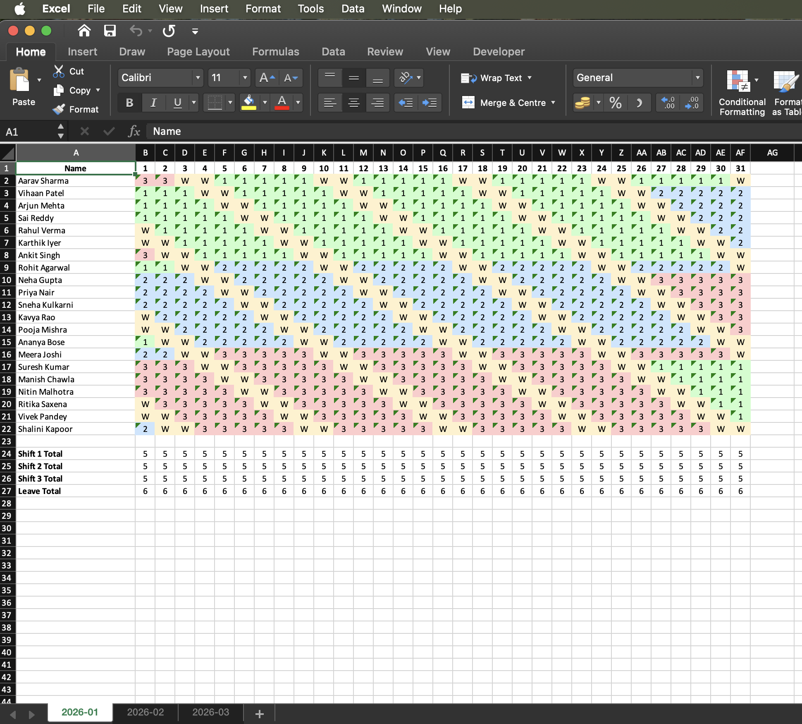

# 24×7 Shift Roster for Operations Team

**Author:** hitesha1981@gmail.com

This project generates a **production-grade 24x7 shift rota** for an operations team
using **constraint programming (OR-Tools CP-SAT)**.

### Getting your environment ready
> **Note:** `ortools` is currently compatible with Python **3.12** on macOS (Intel).

#Install python3.12 or whichever version which has compatible ortools
```bash
python3.12 -m venv .venv
source .venv/bin/activate
pip3.12 install --upgrade pip
pip3.12 install -r requirements.txt
```

## Running the script to generate the rota
```bash
python3.12 generate_rota.py \
  --start-date 01-01-2026 \
  --stop-date 31-01-2026 \
  --employee-details employees.csv \
  --config config.json
```

## Requirements and constraints
### For each employee:
- ✅ **5 consecutive working days + 2 consecutive off days**
- ✅ **Same shift during each 5-day work block**
- ✅ **Shift change only after Week Off**
- ✅ **Minimum 28 days on same shift before rotating**  
  👉 rotate after ≥28 days, on the first workday after OFF–OFF
- ✅ **Rotation order:** `1 → 2 → 3 → 1 → 2 → 3`
- ✅ **Works with minimum 7 employees**
- ✅ **Balanced daily staffing**
- ✅ **≤ 30% leave per day**

## ✅ Input Files

### `employees.csv`

Required columns:

```csv
emp_id,employee_name,starting_shift,gender,contact_number,email,address
```
starting_shift ∈ {1,2,3}

If missing/invalid → automatically assigned round-robin (1→2→3) 

### `config.json`
```json
{
  "min_per_shift": 1,
  "max_off_pct": 0.30,
  "output_file": "shift_rota.xlsx"
}
```

## ✅ Output Files

### `shift_rota.xlsx`
🔽 [Download the full Excel file](shift_rota.xlsx)


